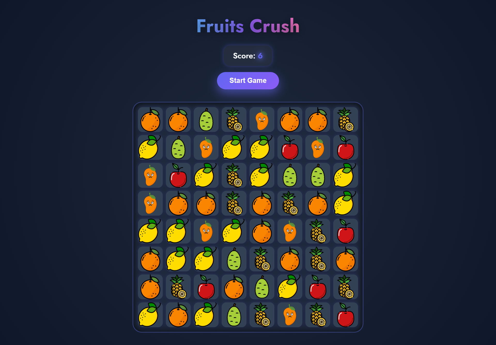

# Fruit Crush

A modern and visually appealing **Fruit Crush** style match-3 game built with **HTML5**, **CSS3**, and **JavaScript**.

---

# Fruits Crush Game GUI


---

## Table of Contents

- [Overview](#overview)  
- [Features](#features)  
- [Demo](#demo)  
- [Installation](#installation)  
- [Usage](#usage)  
- [Technologies Used](#technologies-used)  
- [File Structure](#file-structure)  
- [Customization](#customization)  
- [Contributing](#contributing)  
- [License](#license)  
- [Contact](#contact)  

---

## Overview

This project is a browser-based match-3 puzzle game inspired by popular match-3 games. The goal is to swap adjacent fruit tiles to form a horizontal or vertical line of three matching fruits, which then disappear, earning points.

The game features:

- Drag-and-drop interaction for swapping tiles  
- Continuous match checking with score updates  
- Gravity effect where fruits fall down to fill empty spaces  
- Responsive and modern UI design inspired by premium game interfaces  
- Audio feedback for enhanced gameplay experience  

---

## Features

- **Grid Layout**: 8x8 grid of colorful fruit tiles  
- **Drag & Drop**: Intuitive tile swapping with mouse or touch  
- **Match Detection**: Auto-detects rows and columns of three matching fruits  
- **Scoring System**: Tracks and displays current score  
- **Gravity Effect**: Tiles above fall down to fill gaps  
- **Responsive UI**: Works well on desktop and mobile screens  
- **Sound Effects**: Optional audio cues on tile swap and match  

---

## Demo

Check out the live demo here:  
 

---

## Installation

To run the game locally:

1. Clone the repository:
   ```bash
   git clone https://github.com/shiboshreeroy/fruit-crush.git


2. Navigate to the project directory:

   ```bash
   cd fruit-crush
   ```
3. Open `index.html` in your preferred browser.

---

## Usage

* Drag a fruit tile and drop it on an adjacent tile to swap positions.
* Form a line of three or more matching fruits to clear them and gain points.
* The game will automatically refill empty spaces with new fruits.
* Your current score is displayed at the top.

---

## Technologies Used

* **HTML5** — Semantic markup for structure
* **CSS3** — Responsive and modern styling inspired by TailwindCSS
* **JavaScript (ES6)** — Game logic, drag-and-drop functionality, and DOM manipulation
* **Google Fonts** — Custom font styling with 'Jost' font family

---

## File Structure

```
fruit-crush/
├── images/           # Fruit tile images (png)
├── sounds/           # Optional sound effects
├── index.html        # Main HTML file
├── style.css         # Styling for UI and game grid
├── script.js         # Game logic and event handlers
└── README.md         # This documentation file
```

---

## Customization

You can easily customize the game by:

* Replacing fruit images in the `images` folder with your own icons or sprites.
* Modifying `script.js` to change grid size or add new features like power-ups.
* Updating `style.css` for custom color schemes or animations.
* Adding or tweaking sound effects in the `sounds` folder.

---

## Contributing

Contributions are welcome! If you'd like to:

* Add new features
* Fix bugs
* Improve UI/UX
* Optimize performance

Please fork the repository, create a branch for your feature/fix, and submit a pull request.

---

## License

This project is licensed under the **MIT License**. See the [LICENSE](LICENSE) file for details.

---

## Contact

Created by **Shiboshree Roy** – [shiboshreeroycse@gmail.com](mailto:shiboshreeroycse@gmail.com)
GitHub: [https://github.com/shiboshreeroy](https://github.com/shiboshreeroy)
LinkedIn: [https://linkedin.com/in/shiboshree-roy](https://linkedin.com/in/shiboshree-roy)

---

Thank you for checking out Fruit Crush! Have fun matching those fruits! 🍓🍍🍉

